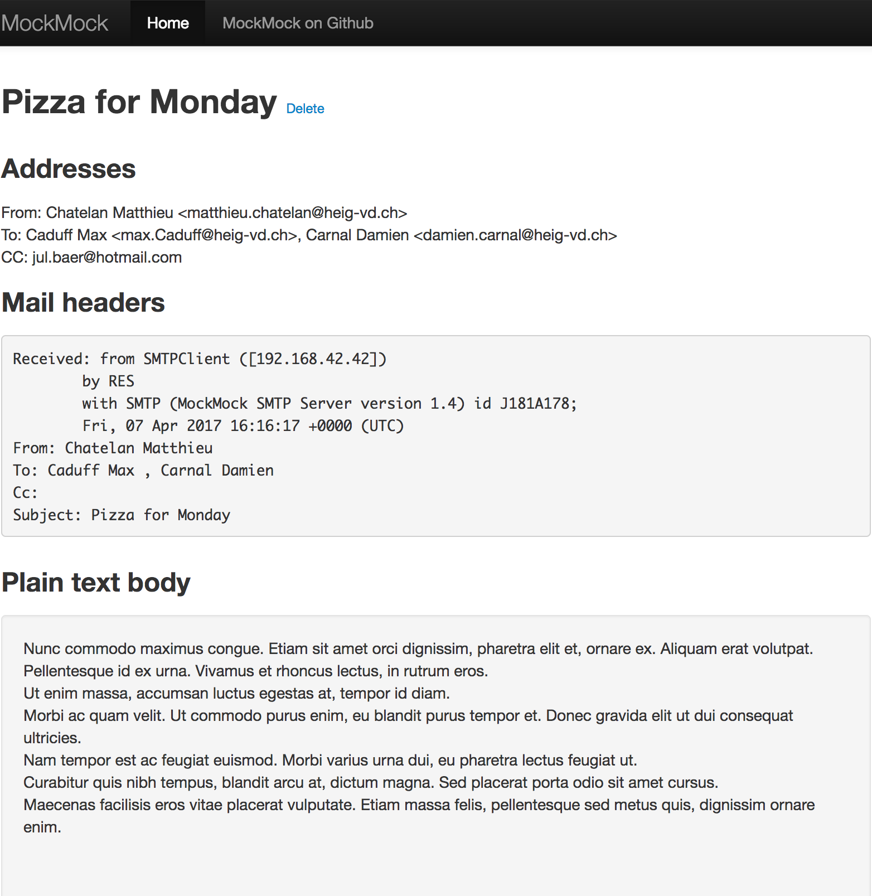
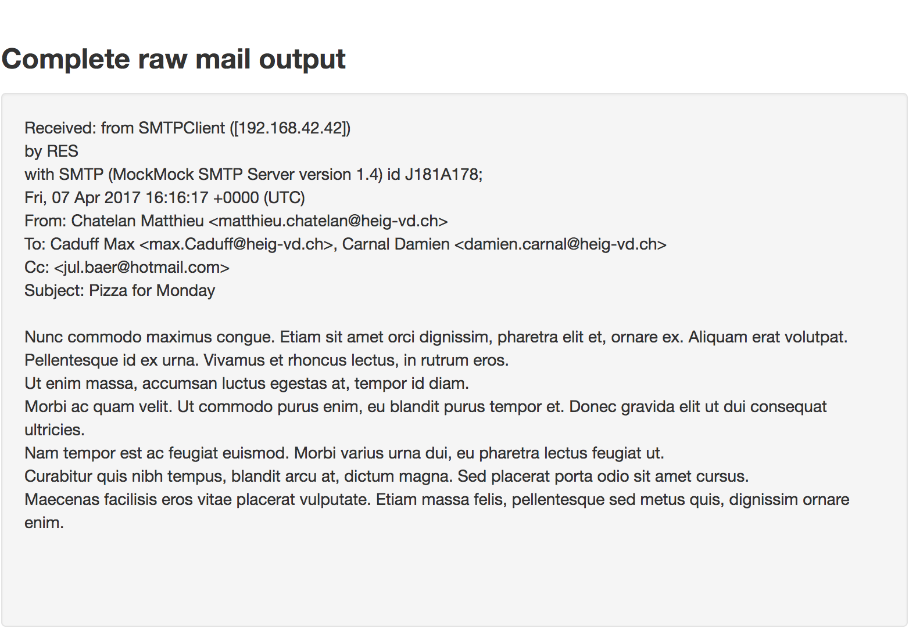

# Teaching-HEIGVD-RES-2017-Labo-SMTP

## Description
This project allow to launch *prank* campaign of forged e-mails.  
The provided tool is based on files and pseudo-random to define who are senders and who are recipients.  

## Caution
Project contains basic implementation of protocol and client SMTP.  
However, SMTP protocol is not fully implemented, meaning tool can possibly crash,  
if server doesn't answer expectedly.  
Therefore, we recommend you use this project as toy and not as production util.  

## Prerequisites
### Dependancies
+ Apache Maven
+ SMTP server (real or mock)

### Resources structure
User must define few files, to make successful *prank* campaign.  
+ __cfg__ directory  
	+ __client.properties__, the configutation file, looks like [configfile](./MailBot/MailBot-code/cfg/client.properties)  
+ __data__ directory  
	1. __victims.utf8__, the victims' list, looks like [victims](./MailBot/MailBot-code/data/victims.utf8)  
	2. __messages.utf8__, the list of messages, looks like [messages](./MailBot/MailBot-code/data/messages.utf8)  

## Use case
Once resources are placed, we can launch campaign with command
```bash
java -jar <jardir>MailBot-code-1.0-SNAPSHOT-standalone.jar <configdir> <datadir>
```

## Test case
If you want to test this tool, a mock server like [MockMock](https://github.com/julien-baeriswyl-heigvd/MockMock "mock server with Web interface") may be useful.  

Once install of mock server and this project is done, you can launch campaign, by starting server first and execute our tool.  

Result will looks like this:  
  
  
  

## Objectives

In this lab, you will develop a client application (TCP) in Java. This client application will use the Socket API to communicate with a SMTP server. The code that you write will include a **partial implementation of the SMTP protocol**. These are the objectives of the lab:

* Make practical experiments to become familiar with the **SMTP protocol**. After the lab, you should be able to use a command line tool to **communicate with a SMTP server**. You should be able to send well-formed messages to the server, in order to send emails to the address of your choice.

* Understand the notions of **test double** and **mock server**, which are useful when developing and testing a client-server application. During the lab, you will setup and use such a **mock server**.

* Understand what it means to **implement the SMTP protocol** and be able to send e-mail messages, by working directly on top of the Socket API (i.e. you are not allowed to use a SMTP library).

* **See how easy it is to send forged e-mails**, which appear to be sent by certain people but in reality are issued by malicious users.

* **Design a simple object-oriented model** to implement the functional requirements described in the next paragraph.


## Functional requirements

Your mission is to develop a client application that automatically plays pranks on a list of victims:

* The user should be able to **define a list of victims** (concretely, you should be able to create a file containing a list of e-mail addresses).

* The user should be able to **define how many groups of victims should be formed** in a given campaign. In every group of victims, there should be 1 sender and at least 2 recipients (i.e. the minimum size for a group is 3).

* The user should be able to **define a list of e-mail messages**. When a prank is played on a group of victims, then one of these messages should be selected. **The mail should be sent to all group recipients, from the address of the group sender**. In other words, the recipient victims should be lead to believe that the sender victim has sent them.


## Example

Consider that your program generates a group G1. The group sender is Bob. The group recipients are Alice, Claire and Peter. When the prank is played on group G1, then your program should pick one of the fake messages. It should communicate with a SMTP server, so that Alice, Claire and Peter receive an e-mail, which appears to be sent by Bob.


## Deliverables

You will deliver the results of your lab in a GitHub repository. 

Your repository should contain both the source code of your Java project and your report. Your report should be a single `README.md` file, located at the root of your repository. The images should be placed in a `figures` directory.

Your report MUST include the following sections:

* **A brief description of your project**: if people exploring GitHub find your repo, without a prior knowledge of the RES course, they should be able to understand what your repo is all about and whether they should look at it more closely.

* **Clear and simple instructions for configuring your tool and running a prank campaign**. If you do a good job, an external user should be able to clone your repo, edit a couple of files and send a batch of e-mails in less than 10 minutes.

In addition, your report SHOULD include (i.e. you will not have penalties if you don't provide the info, but if you want to add this project to your portfolio, it is worth doing it):

* **A concise description of your implementation**: document the key aspects of your code. It is probably a good idea to start with a class diagram. Decide which classes you want to show (focus on the important ones) and describe their responsibilities in text. It is also certainly a good idea to include examples of dialogues between your client and a SMTP server (maybe you also want to include some screenshots here).

* **Instructions for installing and using a mock SMTP server**. The user who wants to experiment with your tool but does not really want to send pranks immediately should be able to use a mock SMTP server. For people who are not familiar with this concept, explain it to them in simple terms. Explain which mock server you have used and how you have set it up.

      
## Evaluation

* See CyberLearn.
